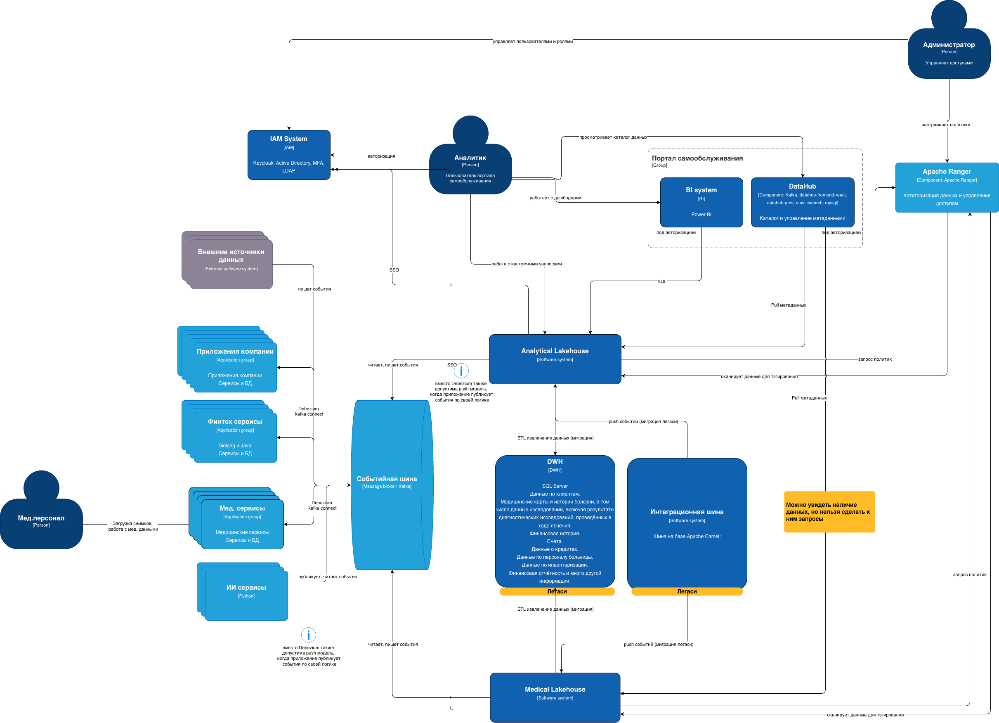

# Задание 3. Проектирование целевой архитектуры и оценка рисков внедрения

TOBE Architecture — горизонт 3 года

Целевая архитектура системы «Будущее 2.0» в **C4-модели** на уровне **контейнеров** и **компонентов**, отражённая в диаграмме `TOBE-future.drawio`: два lakehouse (Analytical и Medical), событийная платформа на Kafka, отказ от легаси на критическом пути. 

# Цели и текущие проблемы

- **Скорость и стоимость аналитики**: сотни ТБ данных, много трансформаций, сложные отчёты формируются часами -> падает производительность аналитики и time-to-market.

- **Масштабирование**: рост по продуктам (новые мед/финтех сервисы, монетизация ИИ), по географии (2–3 региона), по данным (больше источников и событий, переход от batch к near-real-time).

- **Независимость доменов**: развивать направления отдельно, но сохранять целостное представление по ключевым показателям.

- **Self-service «витрина данных»**: единый портал, масштабируемый, с доступом по ролям; **важное ограничение** — *в витрину не включаются медицинские карты/истории болезни/результаты исследований*.

- **Миграция и отказ от легаси**: DWH SQL Server 2008 + Camel + PowerBuilder/BI кастомизации должны уйти с критического пути; допустим обоснованный отказ от легаси.

- **ИБ/регуляторика**: медицинские и финансовые данные требуют строгого контроля доступа и аудита.

# Описание решения
## Кратко

- **Два lakehouse**: **Analytical Lakehouse** (приложения компании, финтех) и **Medical Lakehouse** (мед. сервисы, внешние источники — приборы, лаборатории); разделение по данным и доступу.

- **Отвязаться от легаси**: интеграционная шина **Apache Camel** передаёт события в **Kafka**; легаси **DWH** используется только как источник для **ETL через Airflow** (перелив данных), затем вывод с критического пути.

- **Событийная платформа**: данные в режиме near‑real‑time через Kafka; новые направления подключаются без переноса логики в DWH.

- **Self‑service витрина данных**: портал и **BI подключены только к Analytical Lakehouse**; в витрину не входят медицинские карты, истории болезней и результаты исследований.

- **Единый контроль доступа**: **Apache Ranger** общий для всех lakehouse; IAM для аутентификации.

## Контейнеры (C4 Level 2)

| Контейнер | Назначение | Источники / потребители |
|-----------|------------|--------------------------|
| **Analytical Storage** | S3 (MinIO) + Iceberg/Parquet, зоны bronze/silver/gold. Хранение и витрины для бизнес‑аналитики. | **Источники**: приложения компании, финтех‑сервисы (события в Kafka + при необходимости ETL из DWH через Airflow). **Потребители**: BI, портал самообслуживания, DataHub (каталог), Ranger. |
| **Medical Storage** | S3 (MinIO) + Iceberg/Parquet, зоны bronze/silver/gold. Медицинские и внешние данные (приборы, лаборатории). | **Источники**: мед. сервисы, внешние источники (приборы, лаборатории). **Потребители**: ИИ‑сервисы (через Spark jobs), DataHub (каталог — видимость структуры без доступа к данным без отдельного разрешения), Ranger. |
| **Kafka** | Шина событий. | События от **интеграционной шины Apache Camel** и от приложений; потребляют Airflow и пайплайны загрузки в оба lakehouse. |
| **Airflow** | Оркестратор. | ETL из **легаси DWH** в оба lakehouse (по правилам разделения), построение silver/gold, запуск Spark/Flink джобов. |
| **ИИ‑сервисы** | Работа с медицинскими и аналитическими данными. | Интеграция с **обоими lakehouse** через вызов **Spark jobs** в каждом (отдельные инстансы spark  под Analytical и Medical). |
| **Apache Ranger** | Управление доступом и категоризация данных. | **Общий для всех lakehouse**: политики, теги, row/column‑level security; применяется к Analytical и Medical. |
| **BI** | Дашборды и отчёты. | Подключена **только к Analytical Lakehouse** (витрина данных без мед. карт и результатов исследований). |
| **DataHub** | Каталог данных, домены, термины, семантика. | Подключён **и к Analytical, и к Medical Lakehouse**: полная видимость структур и метаданных; доступ к данным Medical — только при отдельном разрешении (политики Ranger). |
| **IAM** | Аутентификация (Keycloak, AD, LDAP, MFA). | Единая точка входа для портала, BI, DataHub, self‑service слоя. |

## Слой интеграции и событий

- **Интеграционная шина (Apache Camel)**  
  Передаёт события из легаси‑систем в **Kafka**; на этапе миграции используется как мост, далее — вывод.

- **Kafka (Debezium / Kafka Connect при необходимости)**  
  События от Camel и от приложений; потоковая и batch‑загрузка в lakehouse через Flink/Airflow. Операционные БД могут интегрироваться через application-level события (публикация по бизнес‑логике), а не только CDC.

- **Легаси DWH (SQL Server)**  
  Используется **только как источник для ETL**: Airflow читает DWH и переливает данные в соответствующий lakehouse (аналитические потоки — в Analytical, при необходимости исторические мед. агрегаты — в Medical по строгим правилам). С критического пути выводится по мере миграции.

### Data Lakehouse: два контура

**Analytical Lakehouse**

- **S3 (MinIO)** — форматы Iceberg, Parquet; зоны bronze / silver / gold.
- Загружаются данные из **приложений компании** и **финтех‑сервисов** (из Kafka и/или ETL из DWH).
- Airflow/Spark строят витрины; Nessie — версионирование при использовании.
- Потребляют: **BI**, портал самообслуживания, Dremio (если в стеке), DataHub.

**Medical Lakehouse**

- **S3 (MinIO)** — форматы Iceberg, Parquet; зоны bronze / silver / gold.
- Загружаются данные из **мед. сервисов** и **внешних источников** (приборы, лаборатории).
- **ИИ‑сервисы** интегрированы через **Spark jobs**, запускаемые в контуре Medical Lakehouse (и при необходимости в Analytical — для кросс‑доменных сценариев).
- **DataHub** подключён для каталога: видна структура мед. данных; доступ к самим данным — только при отдельном доступе (Ranger). **BI к Medical Lakehouse не подключается.**

В каждом lakehouse свои компоненты (отдельные стенды):

- **Airflow** — оркестрация ETL из DWH и пайплайнов по слоям; запуск Spark jobs в обоих контурах; микробатчевая вычитка из Kafka
- **Spark** — тяжёлые и ML‑джобы; вызывается ИИ‑сервисами в каждом lakehouse по отдельности.
- **Nessie** — git‑like версионирование.

### Self‑service слой и потребление

Состоит из нескольких Application: 
- **Dremio** (если в стеке) — self‑service SQL только по **Analytical Lakehouse**; интеграция с IAM и Ranger. Используется для изучения данных, кастомных SQL отчетов, запросов.
- **DataHub** — каталог по **обоим** lakehouse: структуры мед. данных видны для поиска и понимания, но получение данных Medical — только при отдельном доступе.
- **BI** — подключена **только к Analytical Lakehouse**: дашборды, агрегаты.

### Как изменятся ключевые системы при масштабировании

- **Новые бизнес‑направления**: новые приложения/финтех → новые топики и пайплайны в **Analytical Lakehouse**; новые мед. или внешние источники → **Medical Lakehouse**. ИИ‑сервисы масштабируются через дополнительные Spark jobs в нужном контуре.
- **Дополнительные источники данных**: внешние (лаборатории, приборы) — в Medical; новые корпоративные/финтех‑источники — в Analytical. Единые принципы (схемы, DLQ, Ranger) позволяют подключать источники без переписывания центральной логики.
- **Отказ от легаси**: Camel только передаёт события в Kafka; DWH — только источник ETL через Airflow, с поэтапным выводом. К концу горизонта 3 года — снятие с критического пути.

### Потоки данных (высокоуровнево)

1. **События** — приложения/финтех/мед → Camel (при необходимости) → **Kafka** → Airflow → **Analytical** или **Medical Lakehouse** (по маршрутизации).
2. **Миграция из DWH** — **Airflow** ETL читает DWH → пишет в **Analytical** и при необходимости в **Medical** (по правилам, без PHI в аналитическую витрину).
3. **ИИ** — ИИ‑сервисы вызывают **Spark jobs** в каждом lakehouse; доступ к Medical только через отдельные права.
4. **Аналитика** — пользователь → IAM → DataHub (каталог) / портал / BI → только **Analytical Lakehouse**. Ranger общий для обоих lakehouse.

### Безопасность

- **IAM** — единая аутентификация.
- **Apache Ranger** — общий для **Analytical и Medical Lakehouse**: политики доступа, теги, маскирование; доступ к Medical — по отдельным правилам.
- **DataHub** — видимость структуры Medical без доступа к данным без отдельного разрешения.

---

### Карта рисков трансформации

#### Архитектурные риски

| Риск | Вероятность | Влияние | Описание |
|------|-------------|---------|----------|
| Перегруженная и слишком сложная целевая архитектура | Низкая (горизонт 3 лет) | Высокое | Два lakehouse, Kafka, Airflow, Spark, DataHub, Ranger — рост сложности и стоимости поддержки. |
| Неправильное определение доменных границ (Analytical vs Medical) | Средняя | Высокое | Ошибки в разделении данных приводят к рискам PHI в аналитике или к дублированию. |
| Недостаточное моделирование данных в lakehouse (хаос в bronze/silver/gold) | Высокая | Высокое | Без стандартов схем и слоёв — деградация качества отчётов и доверия. |
| Зависимость от легаси дольше запланированного | Средняя | Высокое | DWH и Camel остаются на критическом пути. |
| Смешение медицинских и аналитических данных или утечка PHI в аналитический контур | Средняя | Высокое | Мед. данные попадают в Analytical или в BI; регуляторные и репутационные риски. |

#### Организационные риски

| Риск | Вероятность | Влияние | Описание |
|------|-------------|---------|----------|
| Недостаток компетенций (Kafka, lakehouse, Ranger, Spark) | Высокая | Высокое | Ошибки в конфигурации, безопасности и пайплайнах. |
| Сопротивление изменениям | Средняя | Среднее | Пользователи остаются на старых отчётах и DWH. |
| Отсутствие единого владельца данных и архитектуры | Средняя | Высокое | Конфликтующие решения по доменам и lakehouse. |
| Недооценка объёма миграции | Средняя | Среднее | Затягивание миграции, параллельные миры. |

#### Технологические риски

| Риск | Вероятность | Влияние | Описание |
|------|-------------|---------|----------|
| Нестабильность Kafka/Camel/коннекторов | Средняя | Высокое | Расхождение данных между источниками и lakehouse. |
| Неправильная настройка прав в IAM и Ranger | Средняя | Высокое | Утечки или блокировка работы аналитиков. |
| Проблемы производительности запросов к lakehouse | Средняя | Среднее | Медленные отчёты и недовольство пользователей. |
| Ошибки в пайплайнах Airflow/Spark | Высокая | Среднее | Неполные витрины, падение доверия к отчётам. |

---

### План управления рисками

#### Риски, снижаемые техническими решениями

- **Разделение Analytical / Medical Lakehouse и защита PHI**  
  Чёткие правила загрузки: в Analytical — только неклинические данные; ETL из DWH с фильтрацией. Ranger-политики, запрещающие доступ к Medical из BI и портала; DataHub — только метаданные для Medical без доступа к данным без отдельной роли.

- **Качество и модель данных**  
  Стандарты слоёв (bronze/silver/gold), именование, контракты схем; DataHub и при необходимости Nessie для версий; schema validation и data quality‑проверки в пайплайнах.

- **Надёжность Kafka и ETL**  
  Мониторинг лагов, DLQ, отказоустойчивый Kafka; fallback batch‑выгрузки через Airflow при сбоях Camel/CDC.

- **Оркестрация (Airflow, Spark)**  
  Тесты DAG и джобов; канареечные прогонки; шаблоны под раздельную загрузку в Analytical и Medical.

#### Риски, снижаемые управленческими подходами

- **Компетенции** — обучение по Kafka, lakehouse, Ranger, Spark; гильдия данных / центр компетенций.
- **Сопротивление** — коммуникация выгод, пилот по одному домену, поэтапное отключение старых отчётов и доступа к DWH.
- **Владение данными** — CDO / архитектурный комитет; data owner / data steward по доменам (Analytical vs Medical).
- **Миграция** — детализированный roadmap, критерии готовности, change management с участием бизнеса и IT.

#### Сводка

- **Техническими решениями** минимизируются: разделение контуров и PHI, стабильность Kafka/ETL, качество данных и схем, политики Ranger/IAM, надёжность пайплайнов.
- **Управленческими подходами** — архитектурные принципы, владение данными, обучение, приоритезация миграции и отказ от легаси, коммуникация с бизнесом.

