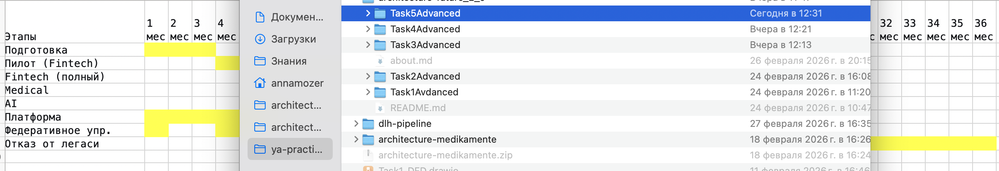

# Роадмап внедрения Data Mesh в «Будущее 2.0»

Data Mesh — децентрализованная архитектура данных, ориентированная на домены (bounded contexts).  
Внедрение Data Mesh позволит компании:

- **Масштабировать аналитику** без роста сложности центрального DWH
- **Ускорить time-to-market** новых отчётов и продуктов.
- **Обеспечить независимость доменов** (Fintech, Medical, AI, Analytics)
- **Сохранить целостное представление** через федеративное управление и самообслуживание

---

## Ключевые роли Data Mesh

| Роль | Ответственность | Кто в компании |
|------|-----------------|----------------|
| **Data Product Owner** | Владелец данных домена: определяет, какие данные публиковать как продукты, отвечает за качество, документацию, доступ. | Руководитель направления (Fintech, Medical, AI), Product Manager |
| **Data Engineer (доменный)** | Разрабатывает и поддерживает пайплайны данных внутри домена, публикует события в Kafka, строит витрины. | Инженер данных, закреплённый за доменом |
| **Data Platform Engineer** | Развивает платформу самообслуживания (Kafka, Airflow, S3, Ranger), обеспечивает SLA, инструменты. | Команда платформы данных (центральная) |
| **Data Steward** | Отвечает за качество данных, соответствие регуляторике, ведение каталога (DataHub). | Аналитик с опытом работы с данными, c поддержкой юриста (GDPR/152-ФЗ) |
| **BI-аналитик / Пользователь** | Потребляет данные через Self-service портал (Dremio), создаёт отчёты, дашборды. | Бизнес-пользователи, аналитики подразделений |
| **Архитектор данных** | Определяет принципы федеративного управления, стандарты, границы доменов. | Enterprise Architect, Solution Architect |

---

## Этапы внедрения

### Этап 0: Подготовка (0–3 месяца)

**Цель:** Определить пилотные домены, создать базовую платформу.

| Активность | Результат | Ответственные |
|------------|-----------|---------------|
| Определение границ доменов (Fintech, Medical, AI) | Карта bounded contexts | Архитектор, Data Steward |
| Выбор пилотного домена (например, **Fintech: Credit Management**) | Протокол, команда пилота | CDO, IT-директор |
| Развёртывание базовой платформы: Kafka, S3, Airflow, Ranger | MVP платформы | Data Platform Engineer |
| Обучение команды пилота | Проведён тренинг | Архитектор, внешние эксперты |
| Назначение Data Product Owner и Data Engineer на пилот | Приказ о назначении | HR, руководители доменов |

**Бизнес-цели этапа:**
- Подготовка к масштабированию.
- Минимизация рисков через пилот.
---

### Этап 1: Пилот в одном домене (3–9 месяцев)

**Цель:** Реализовать первый Data Product, проверить гипотезы, получить обратную связь.

| Активность | Результат | Ответственные |
|------------|-----------|---------------|
| Определение первого Data Product (например, **Кредитные договоры**) | Спецификация продукта | Data Product Owner, BI-аналитик |
| Реализация пайплайна: публикация событий `CreditContractCreated` в Kafka, загрузка в Analytical Lakehouse | Рабочий пайплайн | Data Engineer |
| Построение витрины для BI | Витрина в Analytical Lakehouse | Data Engineer |
| Настройка политик доступа (Ranger) | Доступ только у Fintech и Analytics | Data Platform Engineer |
| Создание дашборда в Power BI | Дашборд по кредитам | BI-аналитик |
| Документирование продукта в DataHub | Карточка Data Product | Data Product Owner |
| Ретроспектива, корректировка принципов | Обновлённый фреймворк | Архитектор, команда пилота |

**Бизнес-цели этапа:**
- Сокращение времени формирования отчётности по кредитам с 4 часов до 30 минут.
- Ускорение подключения новых отчётов (дни вместо месяцев).
- Подтверждение экономической эффективности (TCO).

---

### Этап 2: Расширение на критические домены (9–24 месяца)

**Цель:** Масштабировать Data Mesh на Fintech, Medical, AI.

| Активность | Результат | Ответственные |
|------------|-----------|---------------|
| Запуск домена **Fintech (Account, Payment)** | Data Products: Account, Payment | Data Product Owner (Fintech), Data Engineer |
| Запуск домена **Medical (Patient, Appointment)** — **без PHI в аналитику** | Data Products: Patient (агрегаты), Appointment | Data Product Owner (Medical), Data Engineer, Data Steward |
| Запуск домена **AI (Clinical AI, Research)** | Data Products: AIResearch, AIMetrics | Data Product Owner (AI), Data Engineer |
| Создание антикоррупционных слоёв для интеграции с легаси (Camel → Kafka) | Мосты для миграции | Data Platform Engineer |
| Развитие платформы: Dremio, DataHub, автоматизация quality checks | Платформа версии 2.0 | Data Platform Engineer |
| Внедрение практик Data Quality (Great Expectations) | Дашборд качества данных | Data Steward, Data Engineer |
| Проведение кросс-доменных встреч (федеративное управление) | Регулярный совет по данным | Архитектор, Data Product Owners |

**Бизнес-цели этапа:**
- Полный отказ от legacy-отчётов в пилотных доменах.
- Возможность строить кросс-доменные отчёты (например, "Эффективность ИИ в клиниках").
- Масштабирование без увеличения центральной команды.

---

### Этап 3: Полный переход на Data Mesh + отказ от легаси (24–36 месяцев)

**Цель:** Все домены работают по принципам Data Mesh, легаси выведены с критического пути.

| Активность | Результат | Ответственные |
|------------|-----------|---------------|
| Подключение оставшихся доменов (Inventory, Personnel, External) | Все домены публикуют Data Products | Data Product Owners |
| Миграция последних отчётов из DWH в Analytical Lakehouse | DWH только как архив | Data Engineers |
| Вывод Apache Camel из эксплуатации | Отключение шины | Data Platform Engineer |
| Переход на near-real-time витрины (Kafka → Flink) | Потоковая аналитика | Data Platform Engineer, Data Engineer |
| Зрелое федеративное управление: метрики зрелости Data Products | Политики, SLA | Архитектор, Data Steward |
| Монетизация данных: предоставление Data Products партнёрам (API) | Новый источник дохода | Product Manager, Data Product Owner |

**Бизнес-цели этапа:**
- Поддержка трёх направлений роста: продукты, география, данные.
- Обработка событий в near-real-time.
- Полная независимость доменов.

---

## Роадмап (визуализация)

